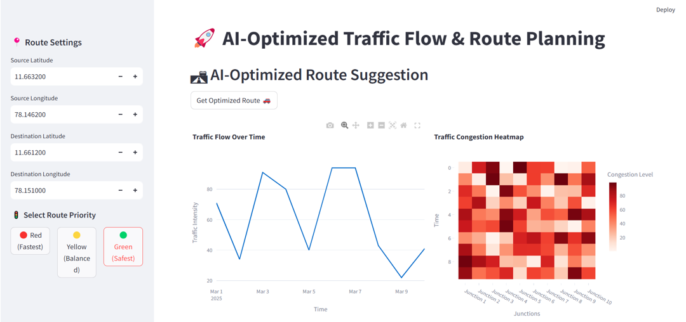
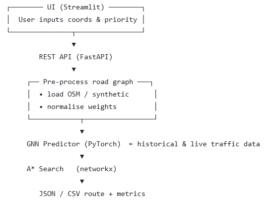
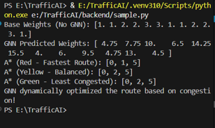

# 🚦 AI‑Optimized Traffic Flow & Route Planning  
*Graph Neural Networks + A\* Algorithm*

## 📌 Overview
This **ongoing project** combines **Graph Neural Networks (GNN)** with **A\*** search to build an intelligent urban traffic system that:
- Predicts congestion levels in real-time
- Suggests optimized routes based on user-defined priorities
- Aims to assist both **individual navigation** and **urban traffic planning**

Initiated as part of **TNWISE 2025 Hackathon** (Theme: Smart Mobility), it’s now being extended as a research-backed prototype.

## ⚙️ Key Features
-  **GNN-based Congestion Prediction** using PyTorch and DGL
-  **A\*** Search Path Planning optimized by GNN edge weights
-  **Priority-based Routing Options:**
  - Red – Fastest Route
  - Yellow – Balanced Route
  - Green – Least Congested Route
-  **Streamlit UI** for interactive input and real-time visualization
-  **Traffic Flow Graphs & Congestion Heatmaps** with Plotly
-  Exportable Results in **CSV/GeoJSON** for integration with Power BI / Tableau

   <em>Prototype UI (Streamlit) – route settings, traffic chart & heat‑map</em> 

## 🧱 System Architecture

   <em>System Architecture</em> 

## 🚀 Quick Start

- Step 1: Clone the repository
git clone https://github.com/<your-username>/TrafficAI.git
cd TrafficAI

- Step 2: Create and activate virtual environment
python -m venv .venv
source .venv/bin/activate  # or .venv\Scripts\activate on Windows

- Step 3: Install dependencies
pip install -r backend/requirements.txt

- Step 4: Run sample demo
python backend/sample.py

## 🧪 Sample Output Preview

Before frontend integration, the route logic was tested using terminal simulations.

- A* Results with No GNN
- A* Results with GNN-based Congestion Weights
- All three user priorities tested: 🚗 Red (Fastest), 🚦 Yellow (Balanced), 🛣️ Green (Least Congested)

📷 Output from `sample.py`:

  <em>Terminal Output<br</em> 

> ✅ This validates that the GNN-assisted A* routing system functions as intended.

## 👥 Team
Joshikaa K, Rakksitha R, Niroshini K

## 📝 To-Do / Roadmap
- Integrate frontend (Streamlit) with FastAPI

- Train GNN with real-world traffic datasets

- Export results to GIS-friendly formats

- Add Docker support for full-stack deployment

- Write unit tests and CI workflows
